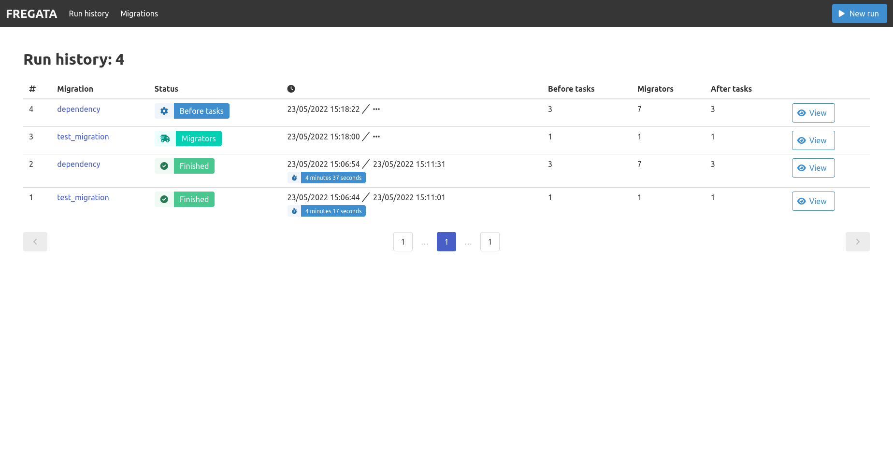
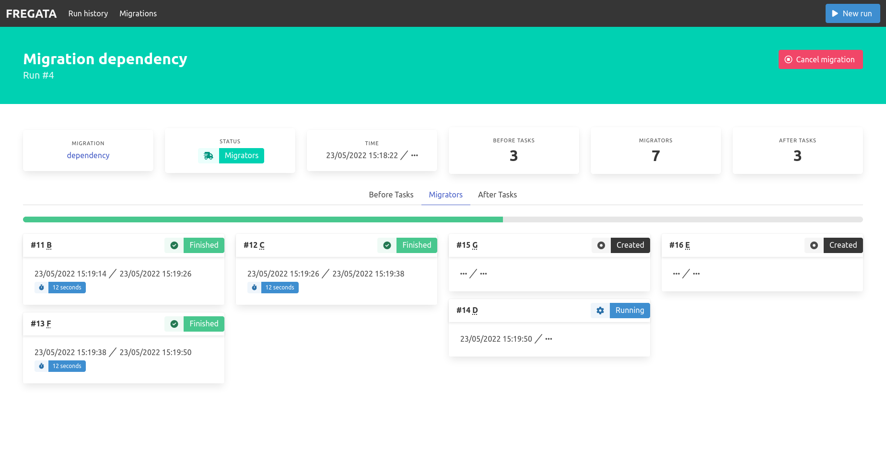

# Fregata Bundle

**Symfony** bundle for the [Fregata](https://github.com/AymDev/Fregata) data migration framework. Provides an UI and
executes migrations asynchronously using the **Messenger** component.


[](//packagist.org/packages/aymdev/fregata-bundle)
[](//packagist.org/packages/aymdev/fregata-bundle)

**Documentation**:

1. [Requirements](#requirements)
2. [Installation](#installation)
   1. [Doctrine entities](#doctrine-entities)
   2. [Messenger transport](#messenger-transport)
   3. [User interface](#user-interface)
3. [User interface overview](#user-interface-overview)
   1. [Main pages](#main-pages)
   2. [Run list](#run-list)
   3. [Run details](#run-details)
4. [Starting a migration](#starting-a-migration)

## Requirements
This bundle requires **PHP >= 8.1** and a **Symfony 4.4** or **5** application. 
Note that as it uses a database, it will install the **Doctrine** bundle.

If you are not familiar with **Fregata**'s features, make sure to read its [documentation](https://github.com/AymDev/Fregata).

## Installation
Install with **Composer**:
```shell
composer require aymdev/fregata-bundle
```

### Doctrine entities 
Then you will need to create the database tables for the provided entities (3 entities + a *ManyToMany* relation). You 
can do this how you want.
>**Suggestion:** My preferred way to use database migrations is by using the 
> [MakerBundle](https://symfony.com/doc/current/bundles/SymfonyMakerBundle/index.html) and its `make:migration` command 
> followed by **Doctrine**'s `doctrine:migrations:migrate` command.

### Messenger transport
As the main work of the bundle happens in *Messenger* components, you need to *route* the provided **messages** to a 
**transport** of your choice.
Example **config/packages/messenger.yaml**:
```yaml
framework:
    messenger:
        transports:
            # You are entirely responsible for the transport configuration
            async: '%env(MESSENGER_TRANSPORT_DSN)%'

        routing:
            # Every message implements the following interface, nothing more is needed
            'Fregata\FregataBundle\Messenger\FregataMessageInterface': async
```

### User interface
To enable the user interface, import the routes by creating a **config/routes/fregata.yaml** file:
```yaml
fregata:
    resource: "@FregataBundle/Resources/config/routes.xml"
    prefix: /fregata
```
>Change the `prefix` to anything you want, or remove it if you want to set the Fregata dashboard at the root of your app.

You can then reach the dashboard at `/fregata`.

## User interface overview

### Main pages
The **dashboard** lists the current migration runs, or the last one if nothing is running.
The **migrations** page lists the currently configured migrations with a link to a dedicated page to get a quick
overview with the list of components and the run history of a specific migration.
The complete **run history** is on a separated page.


### Run list
The table shown here is used in multiple pages of the user interface and contains:

 - the id of the migration run
 - the name of the migration with a link to the **details page**
 - the **status** tag
 - the time stats: start time, end time and duration
 - the number of components
 - a link to the **run details**

### Run details
The same informations can be found on the **run details**:

A cancel button is shown in the top right corner as long as the migration is running.
The run is divided on 3 steps with tabs:

 - Before tasks
 - Migrators
 - After tasks

Each tab shows a progress bar and its associated components. The migrators are sorted according to their dependencies
from left to right.


## Starting a migration

You can start a migration from the user interface by clicking the *"New run"* button in the menu.
Alternatively, the `fregata:migration:execute` console command is available:
```shell
php ./bin/console fregata:migration:execute
```
You should then see the run on the user interface.

If you want to run a migration as in the **Fregata** framework, without Messenger, you can add the `--synchronous` option.
>**Warning**: by doing so, the migration runs in the foreground, doesn't use the database and can't show on the UI.
